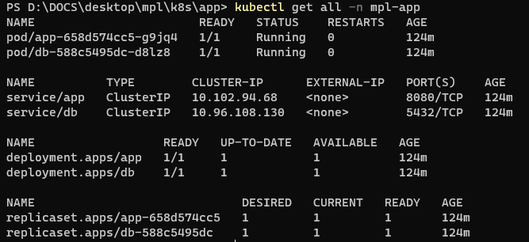
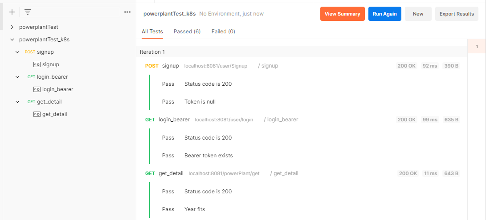
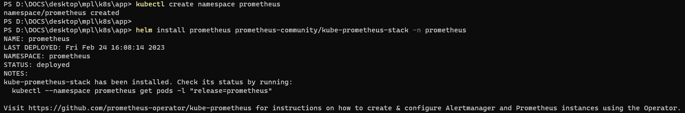
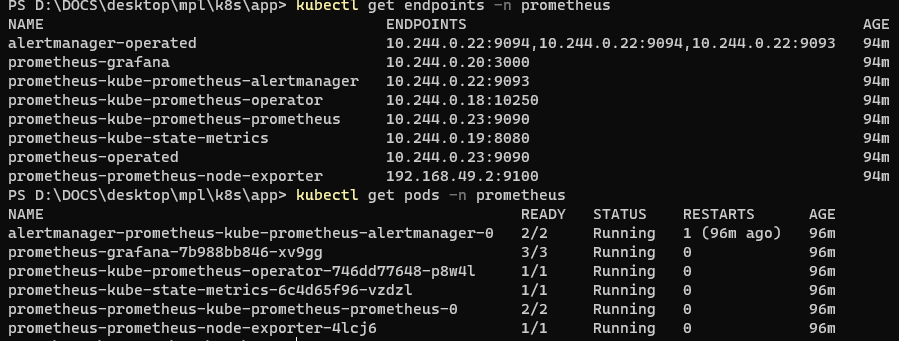
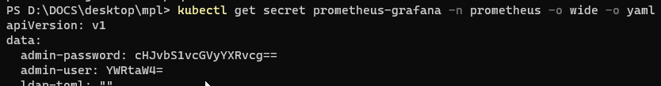
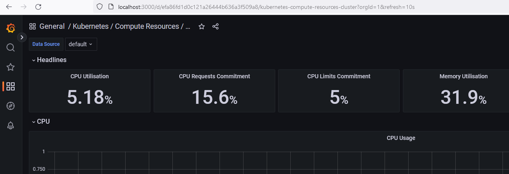

# Test project  
This a test project for interview purposes. It partially contains data of a different project described below in the details.

## Image  
I used the image of a Spring app with PostgreSQL connection from Dockerhub:  
https://hub.docker.com/r/deedat95/docker-spring-boot-postgres

The app code and API description is available on Github, from the same author I assume:  
https://github.com/Nibraz15/backend-interview-task

## docker-compose  
The necessary containers and network can be started by docker-compose from the root of this repository as follows:  
`docker-compose -f .\mpl-docker-compose.yaml start`

You should see containers running in Docker, with he port 8080 exposed to localhost:  

## Postman test
It is possible to test the API with Postman on `localhost:8080` host.
The testing is easier with importing the test collection located in `/postman` directory of this repository.

All the tests should pass successfully if everything runs well in the Docker:  

## minikube
### Resources  
The fastest way was to use [Kompose](https://kompose.io/) and transcript my docker-compose yaml to k8s resources via `kompose convert -f mpl-docker-compose.yaml`.
It was necessary to crerate db-service.yaml manually, as it had no port defined in docker-compose yaml.
Created resources can be found at `/k8s/app` directory of this repository.

### Deploy  
After (optional) creating of a new namespace:  
`kubectl create namespace mpl-app`
it is possible to deploy all the resources from the `/k8s/app` directory:  
`kubectl apply -f .\ -n mpl-app`

After a while, there should be 2 pods running:  

### Test  
For the test of this simple deployment, it is necesary to expose the service endpoint of the pod to the localhost.
After `kubectl get pods -n mpl-app` we know which pod's to forward - ideally to the local port different from 8080 where our Docker instance runs:  
`kubectl port-forward -n mpl-app app-658d574cc5-g9jq4 8081:8080`

In `/postman` directory of this repository there is a `powerplantTest_k8s.postman_collection.json` file prepared to import to Postman and test on `localhost:8081`.
The result should look like this:  

## Prometheus & Grafana
The easiest way to add system monitoring to the cluster is using a [helm chart of a whole stack from prometheus-community helm repository](https://artifacthub.io/packages/helm/prometheus-community/kube-prometheus-stack).

After installing it ...  
  
... and getting necessary port and pod name ...  
  
... it is possible to forward the port to localhost to access Gafana UI:  
`kubectl port-forward -n prometheus prometheus-grafana-7b988bb846-xv9gg 3000:3000`

Default username 'admin' and password 'prom-operator' can be found in Base64 in prometehus-grafana secret:  

After logging in on localhost:3000 address, we can choose some already pre-created dashboards in UI:  

