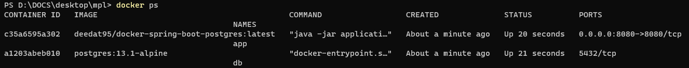
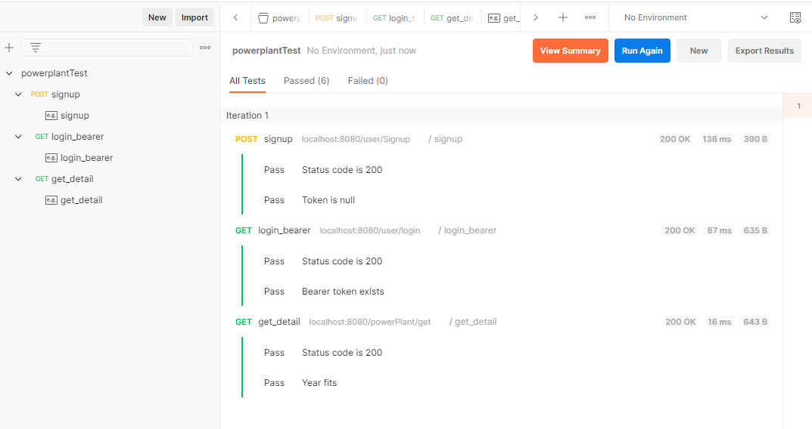

# Test project  
This a test project for interview purposes. It partially contains data of a different project described below in the details.

## Image  
I used the image of a Spring app with PostgreSQL connection from Dockerhub:  
https://hub.docker.com/r/deedat95/docker-spring-boot-postgres

The app code and API description is available on Github, from the same author I assume:  
https://github.com/Nibraz15/backend-interview-task

## docker-compose  
The necessary containers and network can be started by docker-compose from the root of this repository as follows:  
`docker-compose -f .\mpl-docker-compose.yaml start`

You should see containers running in Docker, with he port 8080 exposed to localhost:  

## Postman test
It is possible to test the API with Postman on `localhost:8080` host.
The testing is easier with importing the test collection located in `/postman` directory of this repository.

All the tests should pass successfully if everything runs well in the Docker:  

